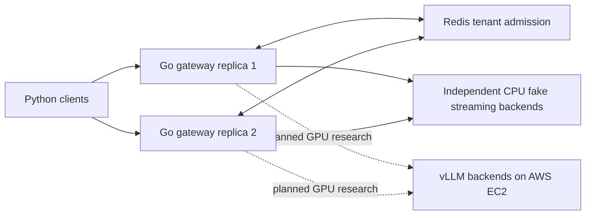
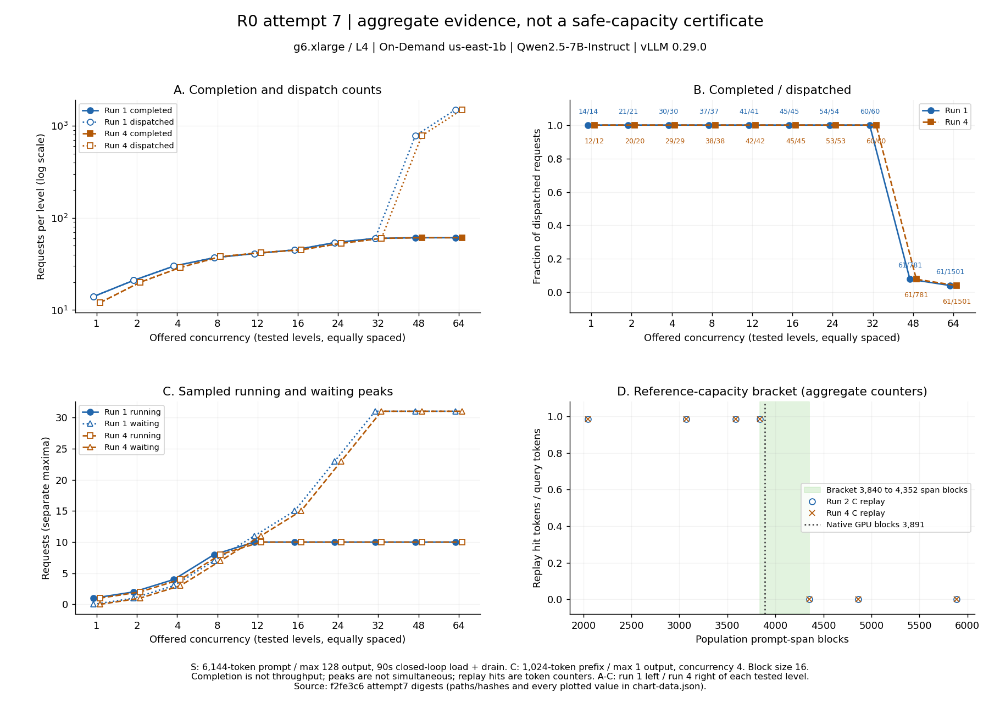

# What Should an LLM Router Remember?

A multi-tenant LLM inference gateway in Go, Redis, vLLM and AWS, built to test how much cache and load state a replicated router should keep, and when to stop trusting it.

**In progress.** This is a source snapshot of reviewed engineering work. Routing-policy comparisons remain planned. The R0 section below reports an accepted aggregate-only GPU measurement and reviewed CPU explanation. Reviewed evidence. Verified in private independent review (Rounds 72–74) and checked by a fresh-context agent claim audit. INF-047 remains incomplete: the release plan's Stage C items (instrumentation contract, re-warm curve, further event-lag capture) are not yet measured. The private source retains its history and independent review records. This snapshot contains code and cited evidence, with one fresh commit and no private planning, review, career or engineering-note files.

## Architecture and implemented behavior



The gateway authenticates credentials, resolves tenant policy, reserves shared admission in Redis, selects one backend and relays one SSE attempt. Upstream headers and the first event are checked before committing a response. Completion requires a validated terminal event; cancellation, timeout, disconnect and shutdown release reservations. Redis quotas enforce rate and concurrency bounds, rather than reserving GPU capacity. The local examples use predictable development credentials and salts which must never be reused for production.

Tenant cache salts are derived server-side. Backend health/load state carries identity, generation and freshness checks. Round-robin, least-loaded and hash-affinity routing are implemented and unit/fake tested; comparative routing performance is planned research. See [gateway code and tests](internal/gateway), [shared admission](internal/admission), [clients and fake backends](python/src/inference_platform) and [Python tests](python/tests).

## Reviewed local deployment and rollout evidence

**Kubernetes (kind, local, mock vLLM backends)** runs two gateway replicas, Redis, two backend pods, opt-in EndpointSlice discovery, probes, preStop draining, PDBs and namespace-scoped list-only EndpointSlice RBAC. Gateways select ready, nonterminating pod IPs directly. Default static BACKENDS behavior stays available. See [pinned manifests and reproduction](deploy/k8s/README.md).

The cited campaigns are [the original reviewed run](experiments/inf037a/kind-2026-10-02-reviewed), [the first coverage follow-up](experiments/inf037a/kind-2026-10-02-r090) and [the confirmed coverage campaign](experiments/inf037a/kind-2026-10-02-r090-confirmed). The confirmed campaign records 16 gateway-update and 24 backend-replacement completions, zero failures/partials/false completions, zero reservations afterwards, and live-stream SIGTERM counts 5/3/4 across the two old gateways and backend. The first follow-up exported measurements but its outer PowerShell capture returned nonzero on expected Docker stderr; it is not an invocation PASS. The original shorter-stream campaign lacked guaranteed per-pod coverage; those historical limitations are retained.

The corrected campaign uses eight closed-loop workers staggered by 0.4 seconds and approximately 30-second fake streams; every terminated pod must have live streams at SIGTERM or the harness fails. These small populations support counts and empirical ranges, not tail-percentile claims. One connection per request, one Windows Docker Desktop host, observation brackets and gateway-observed backend intervals limit attribution. A backend native active counter also verifies coverage. No full 120-second-bound/grace-expiry, real-vLLM, cache recovery, GPU or managed-cluster result is established. Private independent review verified the correction in Round 48. EKS and Kubernetes-with-GPU claims remain reserved for future M5 work.

## Local CPU / mock-backend engineering measurement (INF-036)

The [raw campaigns, protocol, profiles and checksums](experiments/inf036/README.md) and [matched analysis](experiments/inf036/matched-analysis.json) describe a Windows workstation with 32 logical CPUs, two native Go gateways (GOMAXPROCS=2 each), shared Redis 8.2.9 in Docker with a two-CPU budget, and fake/generator processes using GOMAXPROCS=4. Default static round-robin routing, authentication and Redis admission were enabled.

Matched open-loop direct-to-fake and gateway runs alternated over HTTP/1.1 keep-alive SSE, with 5 ms mock first-content delay, six events, 2 s warmup and 12 s measurement, using busy-wait dispatch. Three committed eligible pairs at 1,600 req/s completed 19,200 requests per mode per pair with zero failures. Nearest-rank percentiles require `n*(1-p)>=20`: p50 needs 40 completions and p99 2,000. The claim is **added p50 2.5–3.0 ms and p99 4.9–5.5 ms across three committed paired runs**. Separately, **an independent reviewer rerun (REVIEW Round 45) reproduced p50 2.6–2.9 ms and p99 4.9–5.8 ms**; this is explicitly attributed corroboration in the private review record, not public raw reviewer data. These are paired quantile differences, not individual-overhead percentiles or population confidence bounds.

The highest qualified tested rate was 1,600 req/s and the first tested error/latency knee was 3,200 req/s: **[1,600, 3,200) req/s**, not an exact maximum or soak guarantee. Shared-host, Windows I/O, client/fake/Redis scheduling and default-policy conditions bound attribution. The candidate combined an admission expiry fix and reader pooling, so it does not isolate a latency benefit of pooling. REVIEW Round 45 separately verified the pprof allocation reduction and roughly **6–7 MB higher RSS at concurrency 64**; allocation traffic is not retained memory. Rejected controls, overload outcomes and the earlier dispatcher conditions remain in the cited evidence. No routing/GPU finding, SLO freeze or platform-independent capacity is claimed.

## Early real-vLLM interface checks

INF-011 stages A/B exercised a single L4 vLLM interface, SSE/nonstream compatibility, native metrics and token/context fit. The GPU salt-isolation probes went directly to vLLM with hand-chosen salts; the gateway's HMAC derivation is unit-tested only, and the gateway-in-path session had one tenant. The salt observation was a single request pair, with prompt identity inferred from equal token counts. The cited evidence is [the first session](experiments/inf011/session-2026-09-16-m3) and [the follow-up session](experiments/inf011/session-2026-09-16-m3-followup). Both retain manifests/captures and checksums. The follow-up's short-prompt concurrency sweep did not observe saturation or waiting; it does not establish safe capacity. The first session discarded per-request calibration outcomes. Recorder timings include local gateway/SSM transport and Windows clock quantization; they are not GPU latency benchmarks. Instance-duration cost estimates are not settled AWS billing. Stage C calibration remains incomplete. No GPU utilization, routing comparison or capacity/cost finding follows from these compatibility checks.

## R0 aggregate measurement and CPU explanation (INF-047)

**Reviewed evidence.** Verified in private independent review (Rounds 72–74) and checked by a fresh-context agent claim audit. INF-047 remains incomplete: the release plan's Stage C items (instrumentation contract, re-warm curve, further event-lag capture) are not yet measured.

These qualified findings concern one accepted aggregate-only attempt 7, under the [full numerical conditions and technical story](experiments/r0/README.md): g6.xlarge / one L4, On-Demand us-east-1b, Qwen2.5-7B-Instruct on pinned vLLM 0.29.0. They do not establish a routing benefit, safe R/W/B or an SLO.



- **R0-C1 - measured regime and within-session repeat.** With 6,144-token prompts / max 128 output, 90-second closed-loop load plus drain, runs 1 and 4 reach a running peak of 10 from concurrency 12 and a waiting peak of 31 at 32. First tested pre-content backend rejection is at 48. Both complete 61 requests at 48/64, against dispatched denominators 781/1,501; matched-level completions differ by at most 2. These are counts including drain and separate sampled peak maxima, not throughput, simultaneous occupancy or a safe capacity. [Exact digest fields, levels/runs, denominators and hashes](experiments/r0/chart-data.json).
- **R0-C2 - reference-replay bracket.** For 1,024-token prefixes / max 1 output at concurrency 4, runs 2 and 4 reproduce a last nonzero replay-token-hit candidate at 3,840 prompt-span blocks and first zero-hit candidate at 4,352, bracketing the native report of 3,891 GPU blocks. These are aggregate hit/query token counters, not proof of every request's cache hit, exact reusable capacity or a universal eviction threshold. [Counter derivation and distinction from native capacity](experiments/r0/README.md#reference-replay).
- **R0-C3 - project-specific tested explanation.** Motivated by that plateau, the project tested the official v0.29.0 CPU build (`0.29.0+cpu`; core allocator/scheduler files hash-matched to the release tag), with a configured 3,891-block pool and real KV accounting/scheduling with model computation mocked: under cold, full-input, no-sharing/no-chunking controls, 6,144-token prompts admit 10, 6,272-token prompts admit 9; ten growing requests trigger failure/free/reset/requeue while eight reach +128 computed KV tokens without preemption. Private independent review (Round 72) verified the pre-registration order and independently reproduced all six CPU case traces. This is attributed corroboration in the private review record, not public raw reviewer data. This supports a KV-footprint explanation under those controls, not historical causal proof, live serving timing, gateway admissions or another length's safe R. [Registered chain, controls and trace](experiments/r0/README.md#cpu-explanation).

The four limits remain: TTFT exists only as vLLM histogram buckets; lag under load includes queueing and prefill; "every replayed prefix hit" is an inference from counters; Section 2.5 per-sample validation and warm-up convergence are unassessed. Per-request detail lost at teardown remains lost. Stage C calibration and the full R0 release remain incomplete.

[Evidence, checksums and reproduction](experiments/r0/README.md) keep the GPU and CPU populations separate. The chart renderer and lock ship in this snapshot; the evidence page describes direct reproduction from the snapshot root.

## CPU checks and bounded CI evidence

The private source `cpu-ci` workflow completed successfully at `e5eced3`, run **37093148323**, independently confirmed in private REVIEW Round 49. That run passed the transport regression and the all suite, with one Windows-only preflight test skipped on Linux and passed locally. This names a particular private-source CPU check run; it provides no reliability or deployment guarantee, nor a successful run of this public snapshot.

The [snapshot workflow](.github/workflows/ci.yml) and [public check entrypoint](scripts/check-public.ps1) run Go fmt/vet/build/unit/race, committed-evidence checks, scanner-wrapper tests and the Python modules that do not require excluded private records. Six private-record-dependent Python modules, private PLAN checks, paid approval/payload preflight and private snapshot-builder tests are omitted from this snapshot check command; their files may be retained for source inspection. The original [private check script](scripts/check.ps1) requires excluded private records and is not the snapshot entrypoint. Scanner unit mocks are not publication scans.

Required tools: Go 1.26.6, Python 3.12.7, uv 0.9.5, Git, PowerShell and Docker Linux containers for disposable Redis. See [Go pins](go.mod), [Python pins](python/pyproject.toml), [locked Python dependencies](python/uv.lock) and [synthetic test/schema fixtures](experiments/examples). Hash-pinned tokenizer files may be fetched by tests; no model weights or AWS calls are needed.

On Windows, use a short clone path or pre-set `UV_CACHE_DIR`, `GOCACHE` and `GOMODCACHE` to short cache directories after bootstrap and before running checks.

```powershell
./scripts/bootstrap.ps1
# Set REDIS_TEST_ADDR to a disposable Redis endpoint to include integration tests.
./scripts/check-public.ps1
```

For local fake serving, follow [the CPU deployment instructions](deploy/local/README.md). The [kind campaign entrypoint](scripts/m5-stage1.ps1) and [CPU measurement entrypoint](scripts/inf036.ps1) reproduce separate experiments under their recorded conditions. Cloud orchestration scripts fail closed without the omitted private approvals/payload pins; their presence grants no paid authorization.

## Planned research and current limits

The planned question is: **How much cache and backend-load state should a replicated LLM inference router maintain, and when should it trust that state?** Planned comparisons range from round-robin and fresh load samples to prefix affinity and more detailed cache state under skew, stale observations, backend changes and tenant competition. Protocol and threshold freeze, R0/R1 research releases, full M5 and GPU/cloud rollout work remain pending. The project implements policies within its own gateway; no superiority over external routing systems is established.

This snapshot's cited evidence preserves original bytes and historical status labels. Claims in this README were audited against the committed evidence before publication; review and approval records are maintained privately. No resume material is part of this repository.
